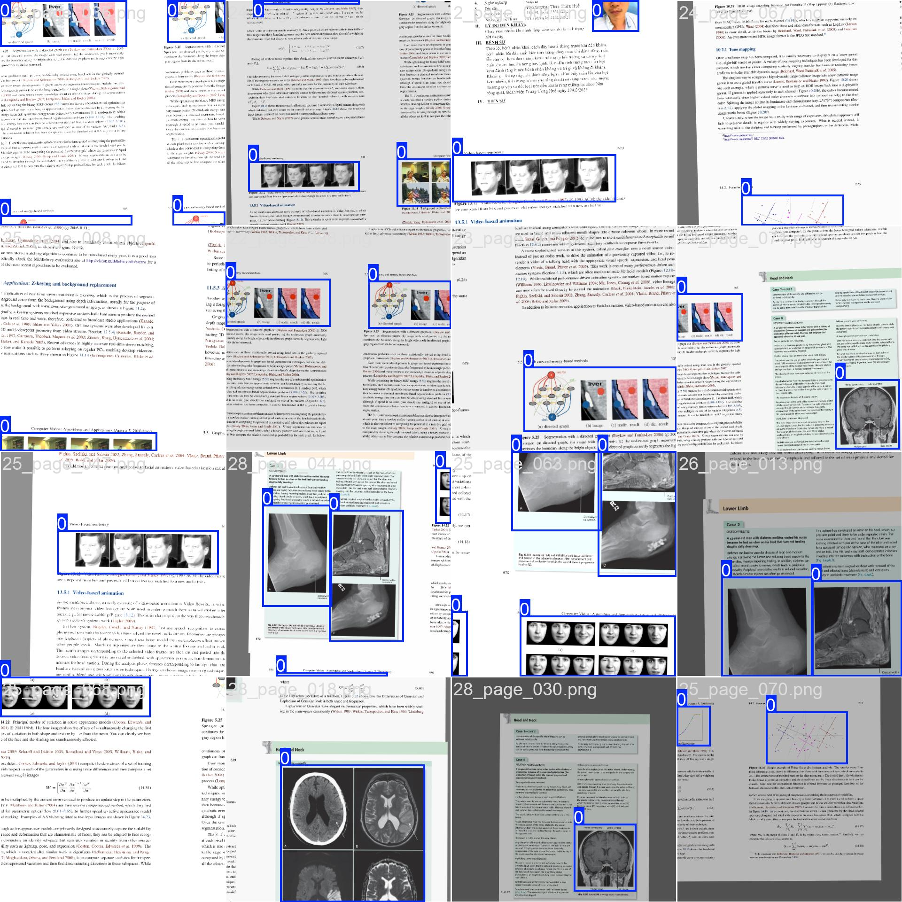

<div align="center">

# **Figure Extractor**
[](https://opensource.org/licenses/MIT)
[](https://github.com/ultralytics/yolov8)

**Extracts figures from PDF documents using YOLOv8n**
</div>

Detects and crops figures (images, charts, diagrams) from PDF documents using a fine-tuned YOLOv8n object detection model. Outputs cropped figure images and structured JSON metadata per document.



---

## Model

| Property | Value |
|---|---|
| Architecture | YOLOv8n (nano) |
| Parameters | 3.01M |
| Pretrained on | COCO (ultralytics/assets) |
| Fine-tuned on | Medical document layout dataset |
| Input size | 640 × 640 px |
| Detection class | `figure` (single class) |
| Weights file | `weights/figure_detect.pt` |

---

## Training Dataset

| Split | Images | Pages with figure | Pages without figure |
|---|---|---|---|
| train | 642 | 477 | 165 |
| val | 80 | 61 | 19 |
| test | 81 | 59 | 22 |
| **Total** | **803** | **597** | **206** |

**Source:** 28 Vietnamese medical PDF documents (bệnh án), annotated with [Labelme v5.11.3](https://github.com/labelmeai/labelme).  
**Annotation format:** Labelme JSON → converted to YOLO format (normalized bounding boxes, single class `figure`).  
**Document resolution:** 2550 × 3300 px (A4 at 300 DPI).

---

## Training Configuration

| Hyperparameter | Value | Rationale |
|---|---|---|
| Optimizer | AdamW | Stable convergence on small datasets |
| Learning rate (lr0) | 1e-3 | Higher lr suits lighter nano architecture |
| LR scheduler | Cosine decay | Smooth annealing to final lr × 0.01 |
| Warmup epochs | 5 | Prevents early instability with pretrained weights |
| Batch size | 16 | Fits GTX 1650 (4 GB VRAM) at imgsz=640 |
| Epochs (max) | 100 | Early stopping at patience=30 |
| Epochs (actual) | ~27 | Early stopping triggered after best epoch ~18 |
| Close mosaic | Last 20 epochs | Improves fine-grained localisation at convergence |
| Flip LR / UD | Off | Documents are not directionally symmetric |
| HSV augmentation | h=0.015, s=0.3, v=0.3 | Handles scan quality variation |
| Degrees | 2.0 | Slight rotation for scanned/skewed pages |
| AMP | Disabled | GTX 1650 AMP causes NaN loss (Ultralytics warning) |

---

## Model Performance

Evaluated on the **validation set** (80 images, 66 figure instances):

| Epoch | mAP@0.5 | mAP@0.5:0.95 | Precision | Recall |
|---|---|---|---|---|
| 12 | 0.951 | 0.726 | 0.960 | 0.864 |
| 18 | **0.981** | **0.811** | **0.984** | **0.935** |

**Best checkpoint: epoch 18** → saved as `weights/figure_detect.pt`

| Metric | Value |
|---|---|
| **mAP@0.5** | **0.981** |
| **mAP@0.5:0.95** | **0.811** |
| Precision | 0.984 |
| Recall | 0.935 |
| F1 | ~0.958 |

---

## Installation

```bash
pip install -r requirements.txt
```

Dependencies: `ultralytics`, `pymupdf`, `pillow`, `numpy`

---

## Usage

### As a Python module

```python
from pathlib import Path
from services.ingestion.figure_extract import FigureExtractor

# Instantiate once — model is loaded at construction and reused
extractor = FigureExtractor(
    conf_threshold=0.35,   # detection confidence (default)
    iou_threshold=0.45,    # NMS IoU threshold (default)
    dpi=300,               # PDF render resolution (default)
)

result = extractor.extract(
    pdf_path=Path("data/pdf/document.pdf"),
    output_dir=Path("output/document/"),
)

print(f"Found {result.total_figures} figures across {result.total_pages} pages")

for fig in result.figures:
    print(f"  Page {fig.page_number} | Figure {fig.figure_index_in_page} "
          f"| Confidence {fig.confidence:.3f} | {fig.crop_filename}")
```

### CLI

```bash
python -m services.ingestion.figure_extract.cli <pdf> <output_dir> [options]

Options:
  --model   Path to .pt weights file   (default: weights/figure_detect.pt)
  --conf    Confidence threshold        (default: 0.35)
  --iou     NMS IoU threshold           (default: 0.45)
  --dpi     PDF rendering DPI           (default: 300)
```

Example:

```bash
python -m services.ingestion.figure_extract.cli \
    data/pdf/benh_an_tim_mach.pdf \
    output/benh_an_tim_mach/ \
    --conf 0.5
```

---

## Output Structure

```
output_dir/
├── figures/
│   ├── page_001_fig_01.png
│   ├── page_007_fig_01.png
│   └── ...
└── metadata.json
```

### metadata.json schema

```json
{
  "source_pdf": "document.pdf",
  "total_pages": 13,
  "total_figures": 2,
  "dpi": 300,
  "conf_threshold": 0.35,
  "iou_threshold": 0.45,
  "figures": [
    {
      "source_pdf": "document.pdf",
      "page_number": 7,
      "figure_index_in_page": 1,
      "figure_index_global": 1,
      "confidence": 0.8231,
      "bbox_pixels": { "x1": 1694, "y1": 805, "x2": 6496, "y2": 6450 },
      "bbox_normalized": { "cx": 0.479958, "cy": 0.328548, "w": 0.562822, "h": 0.511276 },
      "page_width_px": 8532,
      "page_height_px": 11041,
      "crop_filename": "page_007_fig_01.png"
    }
  ]
}
```

| Field | Description |
|---|---|
| `page_number` | 1-indexed page number in the PDF |
| `figure_index_in_page` | 1-indexed position within the page, reading order (top→bottom, left→right) |
| `figure_index_global` | 1-indexed position across the entire document |
| `confidence` | YOLO detection confidence score (0–1) |
| `bbox_pixels` | Absolute bounding box in page pixel coordinates at the rendered DPI |
| `bbox_normalized` | Center-format normalized bbox (cx, cy, w, h) relative to page dimensions |

---

## Tuning Recommendations

| Scenario | Recommended change |
|---|---|
| Too many false positives | Increase `--conf` to `0.5`–`0.6` |
| Missing small figures | Decrease `--conf` to `0.25` |
| Scanned low-res PDFs | Increase `--dpi` to `400` |
| Overlapping detections | Decrease `--iou` to `0.35` |

---

## Module Structure

```
figure_extract/
├── __init__.py       # Public API: FigureExtractor, FigureMetadata, ExtractionResult
├── extractor.py      # Core extraction logic (FigureExtractor class)
├── models.py         # Immutable domain models (BoundingBox, FigureMetadata, ExtractionResult)
├── cli.py            # CLI entry point
├── requirements.txt  # Runtime dependencies
└── weights/
    └── figure_detect.pt  # Fine-tuned YOLOv8n weights
```

---

## Acknowledgements

Special thanks to the following contributors for their help in collecting and annotating the training dataset:

- [ngynthingcthao](https://github.com/ngynthingcthao)
- [TN-Thien](https://github.com/TN-Thien)
